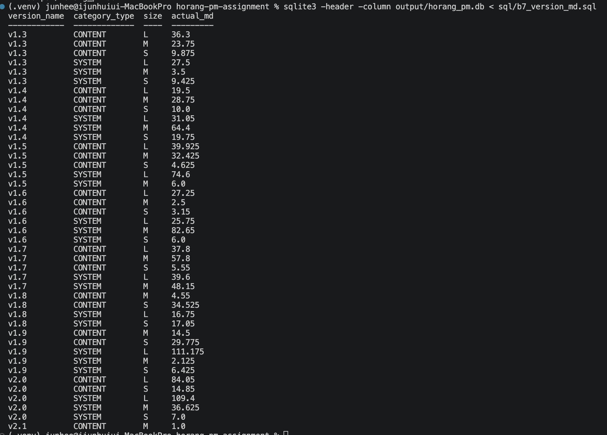
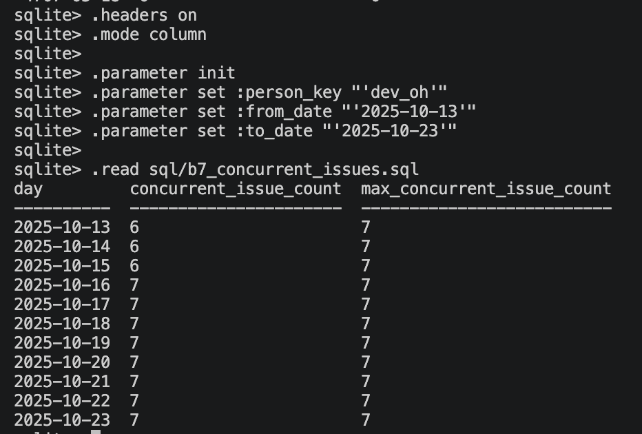

# 산출물 B — Jira 데이터를 DB로 가져오는 방법 설계

## B-1. Jira API 원본에서 MD 계산을 막는 지점

A-2에서는 `8시간 = 1 MD`, Worklog 작성자 role 기준 공정 구분, `Category × Size × Process` 집계를 사용한다.  
`jira_api_raw_sample.json`을 그대로 적재하면 아래 항목 때문에 이 기준으로 계산하기 어렵다.

| 문제 | 원본 예시 | 처리 |
|---|---|---|
| 시간 표현 혼재 | `"30d"`, `originalEstimateSeconds`, `timeSpentSeconds` | 계산은 초 단위 사용. `1MD = 28,800초` |
| Worklog 중첩 배열 | `fields.worklog.worklogs[]` | Worklog 1건을 DB 1행으로 분리 |
| 작성자 직군 없음 | `author.accountId`만 존재 | Jira 계정 ↔ `people.csv` 연결 후 PLAN/DEV/ART 결정 |
| Fix Version 배열 | HRG-1032: `v1.8`, `v1.9` | Issue-Version 관계로 분리, 복수 귀속은 A-1 규칙 적용 |
| Custom Field 의미 불명 | `customfield_10031`, `customfield_10245` | `/rest/api/3/field` Metadata로 의미를 매핑 |
| Issue 총 시간만으로 공정 분리 불가 | `timeSpentSeconds`, `aggregatetimespent` | Actual MD는 작성자가 있는 개별 Worklog 기준 |

추가로 필요한 정보는 다음 네 가지다.

- Jira `accountId` ↔ 사내 인력 정보
- Custom Field Metadata
- Jira Version Close 정보
- 실제 QA 담당자/Worklog 정보

따라서 Raw는 보존하되, MD 계산 전 **시간 표준화 → Worklog 분리 → 작성자 공정 매핑 → Fix Version 처리 → Custom Field 표준화**가 필요하다.

---

## B-2. Jira 원본 → DB 필드 매핑

시간은 문자열보다 Jira의 초 단위 값을 우선 사용하고, 배열형 Worklog/Fix Version은 별도 행으로 분리한다.

| 원본 위치 | DB 컬럼 | 타입 | 적재 전 변환 | NULL 처리 | Jira 변경 영향 |
|---|---|---|---|---|---|
| `id` | `issue.jira_issue_id` | TEXT | 그대로 | 오류 | 낮음 |
| `key` | `issue.issue_key` | TEXT | 그대로 | 오류 | 낮음 |
| `fields.summary` | `issue.summary` | TEXT | 그대로 | 허용 | 낮음 |
| `fields.issuetype.name` | `issue.issue_type` | TEXT | 그대로 | 허용/기록 | 유형 변경 영향 |
| `fields.status.name` | `issue.status` | TEXT | 상태명 저장 | 오류 기록 | Workflow 영향 |
| `fields.assignee.accountId` | `person.jira_account_id` → `issue.assignee_person_key` | TEXT | 내부 `person_key` 변환 | 미지정 NULL, 실패 오류 | 인력 Mapping 영향 |
| `fields.created` | `issue.created_at` | TIMESTAMP | UTC 변환 | 오류 | 낮음 |
| `fields.resolutiondate` | `issue.resolved_at` | TIMESTAMP | UTC 변환 | 미완료 NULL | Workflow 영향 |
| `fields.timetracking.originalEstimateSeconds` | `issue.original_estimate_seconds` | INTEGER | 초 그대로 | NULL | 낮음 |
| Size Custom Field | `issue.size_label_raw` | TEXT | Metadata로 필드 식별 | NULL | 높음 |
| Category Custom Field | `issue.category_type` | TEXT | SYSTEM/CONTENT 표준화 | 실패 시 계산 중단 | 높음 |
| Story Point Custom Field | `issue.story_points` | REAL | 숫자 변환 | NULL | 높음 |
| `fields.parent.key` | `issue.parent_key` | TEXT | key 추출 | NULL | 계층 영향 |
| `fields.fixVersions[].id` | `version.jira_version_id` | TEXT | 별도 Version 저장 | NULL | 낮음 |
| `fields.fixVersions[].name` | `version.version_name`, `issue_version.version_name` | TEXT | Issue-Version 관계 생성 | 관계 미생성 | 이름 변경 영향 |
| `fields.worklog.worklogs[].id` | `worklog.worklog_id` | TEXT | Worklog별 행 생성 | 오류 | 낮음 |
| `fields.worklog.worklogs[].author.accountId` | `person.jira_account_id` → `worklog.author_person_key` | TEXT | 내부 `person_key` 변환 | 실패 오류 | 인력 Mapping 영향 |
| `fields.worklog.worklogs[].started` | `worklog.started_at` | TIMESTAMP | UTC 변환 | 오류 | 낮음 |
| `fields.worklog.worklogs[].timeSpentSeconds` | `worklog.time_spent_seconds` | INTEGER | 초 그대로 | 계산 제외+오류 | Actual MD 핵심 |
| `changelog.histories[].id` | `issue_status_history.history_id` | TEXT | 상태 변경 ID | 오류 | 낮음 |
| `changelog.histories[].created` | `issue_status_history.changed_at` | TIMESTAMP | UTC 변환 | 오류 | 낮음 |
| Status `fromString` | `issue_status_history.from_status` | TEXT | Status 변경만 추출 | 최초 NULL | 상태명 영향 |
| Status `toString` | `issue_status_history.to_status` | TEXT | Status 변경만 추출 | 오류 | 상태명 영향 |

`fields.updated`는 증분 동기화 조회 기준으로 사용하고, 현재 정제 테이블에는 별도 저장하지 않는다. Watermark는 B-4 수집 단계에서 관리한다.

### 핵심 변환 규칙

- 시간: `Actual MD = SUM(worklog.time_spent_seconds) / 28,800`
- Jira 기존 Size → `issue.size_label_raw`
- A-2 기준 재계산 Size → `issue.size_class`
- 복수 Fix Version → `issue_version`으로 분리, 현재 CSV에서는 귀속 불명확 시 `include_in_md = 0`
- Custom Field ID는 코드에 직접 고정하지 않고 `jira_field_map`으로 의미 기반 매핑
- 필드 누락/타입 변경 등 의미를 확인할 수 없는 경우 임의 기본값으로 처리하지 않고 영향받는 계산을 중단

---

## B-3. 실제 작업기간 계산

Jira에는 별도 시작일이 없으므로 Changelog 상태 이력을 저장한다.

| 컬럼 | 의미 |
|---|---|
| `issue_key` | Jira Issue |
| `history_id` | 변경 이력 ID |
| `changed_at` | 변경 시각 |
| `from_status` | 변경 전 |
| `to_status` | 변경 후 |

HRG-1032의 예시는 다음과 같다.

`To Do → In Progress → In Review → Done → In Progress → Done`

규칙:

- 시작: 최초 `In Progress`
- 종료: 마지막 `Done`
- 실제 작업기간: `In Progress` 구간의 합
- `In Review`, `On Hold`: 작업기간에서 제외
- 해당 기간에 기록된 Worklog는 실제 투입이므로 Actual MD에는 포함

즉 **상태 이력은 작업기간**, **Worklog는 투입 MD** 계산에 사용한다.

---

## B-4. Jira 데이터 동기화 방식

| 항목 | 결정 |
|---|---|
| 수집 방식 | Jira `updated` 기준 증분 동기화 |
| Watermark | 마지막 성공 시각 저장, 다음 조회는 `watermark - 24h`부터 재조회 |
| 주기 | 매일 00시 / 12시, Version Close 시 추가 1회 |
| 멱등성 | Issue/Worklog/Changelog 고유 ID 기준 Upsert |
| Rate Limit | `1 → 2 → 4 → 8분` 지수형 재시도, 최종 실패 시 watermark 미갱신 |
| 배포 후 수정 | Close 전에는 재계산, Close 후에는 Raw만 저장하고 명시적 승인 후 재계산 |

Watermark 구간을 겹쳐 조회해 누락 위험을 줄이고, 중복은 Upsert로 제거한다.  
Version Close 이후 확정값을 자동 수정하지 않는 이유는 과거 수정으로 baseline과 이미 통지된 일정이 조용히 바뀌는 것을 막기 위해서다.

---

## B-5. Raw 보관 및 재처리

Jira 원본은 DB 적재 후에도 수정하지 않고 JSON으로 보관한다.

```text
data/raw/jira/
└── 2026-01-26/
    ├── 0000/
    │   ├── issues.json
    │   ├── worklogs.json
    │   └── changelogs.json
    └── 1200/
        ├── issues.json
        ├── worklogs.json
        └── changelogs.json
```

규칙이 바뀌면:

`Raw → 새 변환 규칙 → 대상 데이터 재적재 → MD 재계산`

순서로 다시 처리한다. 기존 계산 결과를 먼저 제거한 뒤 재적재하여 구 규칙과 신 규칙의 결과가 섞이지 않게 한다.

---

## B-6. DB 테이블 설계

연간 약 2천 건 규모이고 과제 재현성이 중요하므로 SQLite를 사용한다.

| 단계 | 목적 | 주요 객체 |
|---|---|---|
| Raw | Jira 원본 보관 | `raw_jira_payload` |
| Refined | 계산용 정제 데이터 | `issue`, `worklog`, `issue_version`, `person`, `issue_status_history`, `version`, `calendar_day`, `jira_field_map` |
| Summary | Version × Category × Size × Process MD | `vw_version_category_size_md` |

주요 역할:

- `issue`: Issue 기본값, 원본/재계산 Size, 상태, 기간, estimate
- `issue_version`: 복수 Fix Version 관계와 `include_in_md`
- `worklog`: Actual MD 원천
- `person`: role → process, availability
- `issue_status_history`: 실제 작업 구간 계산
- `version`: 계획/실제 배포일, Jira Close
- `calendar_day`: 공휴일/PTO
- `vw_version_category_size_md`: 정제 데이터 기반 집계 VIEW

연간 규모가 작아 Partition은 두지 않고 다음 Index로 조회를 보완한다.

| 대상 | Index |
|---|---|
| Worklog | `issue_key` |
| Worklog | `author_person_key, started_at` |
| Issue Version | `version_name, issue_key` |
| Issue | `assignee_person_key, started_at, resolved_at` |
| Status History | `issue_key, changed_at` |

실제 DDL은 `sql/schema.sql`에 분리한다.

---

## B-7. 핵심 조회 쿼리

제공 CSV를 `scripts/b7_load_sqlite.py`로 실제 적재하여 `output/horang_pm.db`를 생성했다.

적재 시 다음을 처리했다.

- Worklog `h`/`d` → 초 단위
- 복수 Fix Version 관계 분리, 중복 위험 Issue 집계 제외
- CSV에 없는 Worklog ID는 적재 테스트용 고유 ID 생성
- `size_label`은 원본 보존, A-2 기준으로 `size_class` 재계산
- Size 계산 정보 부족 시 기존 Size로 보정하지 않고 `UNCLASSIFIED`

### 1. Version별 Category × Size Actual MD

쿼리: `sql/b7_version_md.sql`

`Actual MD = SUM(time_spent_seconds) / 28,800`

v1.9 결과:

| Version | Category | Size | Actual MD |
|---|---|---|---:|
| v1.9 | CONTENT | M | 19.750 |
| v1.9 | CONTENT | S | 9.650 |
| v1.9 | CONTENT | UNCLASSIFIED | 14.875 |
| v1.9 | SYSTEM | L | 53.375 |
| v1.9 | SYSTEM | M | 30.500 |
| v1.9 | SYSTEM | S | 6.050 |
| v1.9 | SYSTEM | UNCLASSIFIED | 29.800 |

합계는 **164.0 MD**다. `UNCLASSIFIED`도 Worklog가 존재하므로 총 Actual MD에서는 제외하지 않는다.



### 2. 특정 기간 담당자의 동시 담당 Issue

쿼리: `sql/b7_concurrent_issues.sql`

정의: `started_at <= 기준일 <= resolved_at`

- 담당자: `dev_oh`
- 기간: `2025-10-13 ~ 2025-10-23`
- 최대 동시 담당: **7건**

2025-10-13~15는 6건, 10-16~23은 7건이었다.

제공 CSV에는 Assignee 변경 이력이 없으므로 현재 assignee를 작업기간 전체에 적용했다. 실제 Jira 연동 시에는 Assignee Changelog로 실제 담당 구간을 구성한다.



---

## B-8. 측정한 MD를 기준표로 되돌리는 규칙

### Baseline 단위

Version 총 MD를 그대로 비교하지 않는다.  
각 Version에서 먼저 **`Category × Size × Process`별 관측 Issue 1건당 Actual MD**를 계산한다.

1. Worklog → `Issue × Process` MD
2. Issue별 Actual MD 계산
3. Version별 `Category × Size × Process`의 관측 Issue 평균
4. Version 실적으로 저장

Worklog가 없는 Issue는 `0`이 아니라 `UNKNOWN`이며 평균 분모에서 제외한다.  
`UNCLASSIFIED`도 S/M/L baseline 갱신에는 사용하지 않는다.

### 후보값과 승인

- 최근 **유효한 종료 Version 3개**의 Issue당 Actual MD 중앙값을 baseline 후보로 사용
- 유효 Version: Jira Close 완료 + B-10 검증 통과 + 해당 셀의 관측 Worklog 존재
- 자동 계산 후 **파트 리더 승인**
- 승인 시 기존/후보 baseline, 최근 실적, Issue 수, Worklog 기록률, UNCLASSIFIED 여부를 확인
- 후보가 기존 baseline 대비 **±50% 이상**이면 별도 검토  
  (`50%`는 통계적 이상치가 아니라 초기 운영 안전장치)
- QA proxy는 실제 QA MD처럼 자동 갱신하지 않음

승인된 baseline이 바뀌면 향후 일정을 재계산한다. 이미 통지한 기획 착수일이 바뀌면 기존 값을 조용히 덮어쓰지 않고 **기존일 / 변경일 / 변경 영업일 / 근거 Version**을 다시 알린다.

흐름:

`Version Close → B-10 검증 → Issue당 Actual MD → 최근 3개 중앙값 → 리더 승인 → baseline 반영 → 일정 재계산 → 변경 시 재통지`

---

## B-9. Jira 변경으로 인한 잘못된 계산 방지

핵심은 오류가 나지 않은 채 잘못된 값이 계속 생성되는 **silent failure**를 막는 것이다.

### 감지

동기화 시 Field Metadata와 Workflow 상태를 직전 정상 상태와 비교한다.

- 핵심 Field 존재/ID/타입 변경
- 새로운 Status, 이름 변경, 삭제
- UNKNOWN/UNCLASSIFIED 급증
- 기존 핵심 Field의 NULL 급증

다음은 허용 건수 `0`으로 둔다.

- Size/Category Field Mapping 실패
- 예상과 다른 타입
- 정의되지 않은 Workflow Status
- Worklog 작성자 공정 Mapping 실패

### 대응

`Raw 저장 지속 → 영향받는 계산 중단 → 변경/영향범위 기록 → 담당자 의미 확인 → Mapping/규칙 수정 → Raw 재처리 → 검증 후 재개`

확인되지 않은 값을 기존 상태나 기본값에 임의 연결하지 않는다.

---

## B-10. DB 값과 Jira 정합성 상시 검증

| 검증 항목 | 비교 | 주기 | 허용 차이 | 불일치 시 |
|---|---|---|---:|---|
| Issue 동기화 | Jira 변경 Issue Key ↔ DB 반영 Key | 00/12시 동기화 후 | 0% | 동기화 실패, 재수집 |
| 핵심 Issue 값 | status, assignee, Fix Version, Category, Size | 변경 Issue마다 | 0% | 계산 중단, Raw부터 재적재 |
| Worklog | 건수 + `timeSpentSeconds` 합계 | 매 동기화, Close 시 전체 | 0% | 재수집, MD 확정 중단 |
| Jira 화면 표본 | 상태/담당자/Version/Worklog 합계 | 주 1회 | 불일치 0건 | 동일 유형 전체 재검증 |

Version Close 전 최종 검증:

`Issue 목록 → 핵심 필드 → Worklog 건수/시간 합계 → 일치 시 MD 확정 → baseline 후보 계산`

하나라도 맞지 않으면 해당 Version의 MD 확정과 baseline 갱신을 보류한다.
